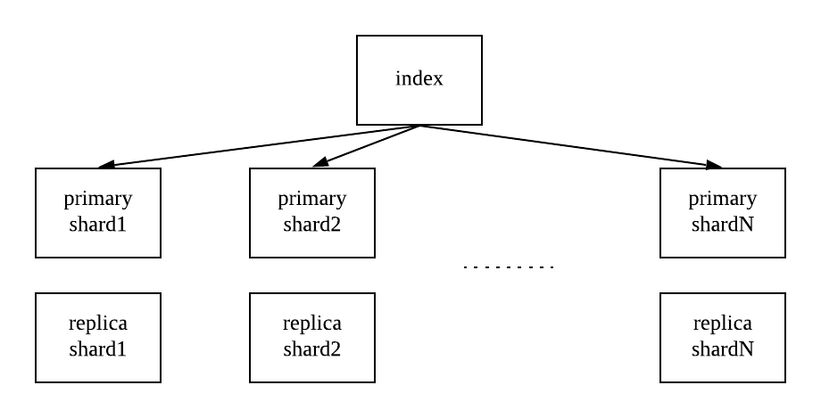
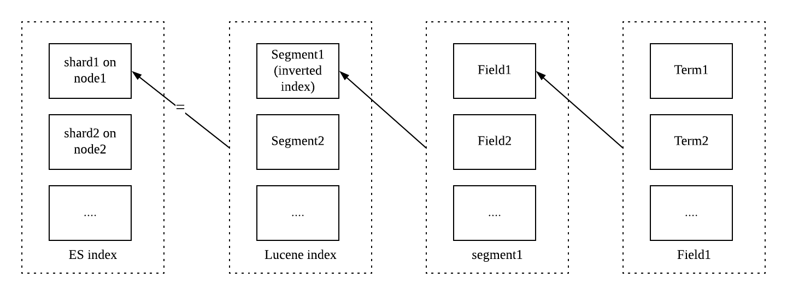
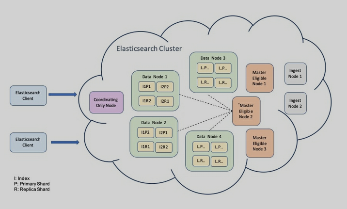
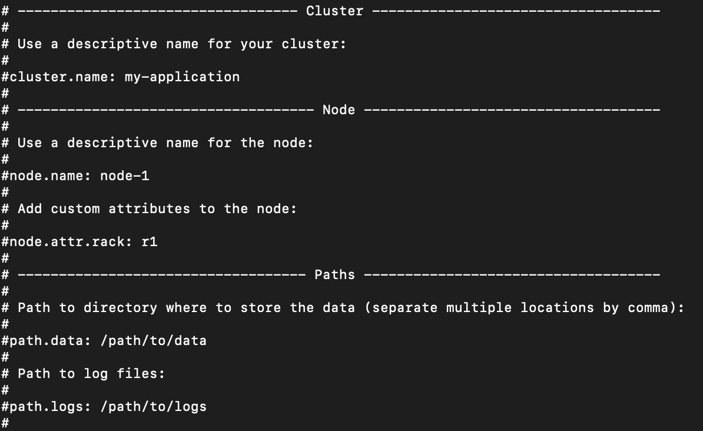
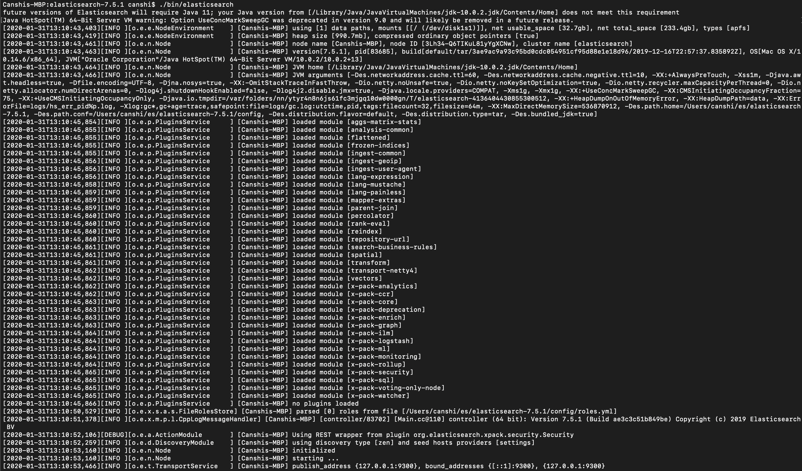

# Basic Concept

## Overview

* Elasticsearch is developed in Java
* Elasticsearch provides real-time search and analytics for all types of data
* Use Apache Lucene as search framwork

## Key Concept

## Document:

* The smallest unit for searching
  * Log
    * Meta data for movie
    * PDF/Music
* Using JSON format
  * Document is a group of fields.
    * Field is the smallest unit of data in elasticsearch. It can contain a list of multiple values of the same type
  * Every field has a type
  * ElasticSearch is able to infer the type of field
* Every document as unique ID
  * Specified by user
  * Generate by system
* MetaData for Document
  * _index: logical namespace of one or multiple physical sharding.
  * _type: type of the document
  * _id: unique id for document
  * _source: original JSON data
  * _version: version of the document. (ES version)
  * _score: searching related score
* Example: 
    ```
    {
      "name": "Avengers: Endgame"
      "producer"‎: "‎Kevin Feige"	
      "company"‎: ‎"Marvel Studios"
    }
    ```

    is stored as

    ```
    {
      "_index": "movies",
      "_type": "_meta",
      "_id": "123",
      "_version": 1,
      "_seq_no": 0,
      "_primary_term": 1,
      "_source": {
        "name": "Avengers: Endgame"
        "producer"‎: "‎Kevin Feige"	
        "company"‎: ‎"Marvel Studios"
      }
    }
    ```

### Index
* Index: Container of the documents
  * Index represent logical namespace: every index has their defination of mapping, used to define the field and field type
  * Shard represent physical namespace: data of index are distributed to different shard
* Index Mapping and setting:
  * Mapping: define document field
  * Setting: define data distribution
* Example: 

  ```
  {
    "movies": {
      "settings": {
        "index": {
          "creation_date": "1552737458545",
          "number_of_replicas": "0",
          "uuid": "Qn13esMNposKDF",
          "version": {
            "created": "6060299"
          },
          "provided_name": "movies"
        }
      }
    }
  }
  ```
  

### Shard
* Shard is basic r/w unit, enables parallel r/w opration
* Two types of data: 
  * primary shard
  * replica shard
  * Elasticsearch ensures that primary and the replica of the same shard will not collocate in the same node
  
* Relationship between index and shard
  * Every index contains multiple shards
  * Every shards is a lucene index
  * Every lucene index contains multiple segment, using inverted indexing
  * Every segment composed of multiple field
  * Every field associate with multiple term
  
    

### Cluster

* Distributed cluster: 
  * Master-Slave: 
    * ES, HDFS, HBase
  * Dynamo:
    * Cassandra
* Role of Nodes
  * Master Node:
    * Manipulate cluster related operation
    * Set `node.master: true` enable the node qualified to be choosed as master
    * Unique in the cluster
    * Each Master-eligible node should know the number of Master-eligible nodes. 
    * To avoid multiple master been elected (brain split) when network partition, setting of `discovery.zen.minimum_master_nodes` as the result of `(master_eligible_nodes / 2) + 1`
  * Data Node: store data that contains indexed document. Set `node.data: true` enable node to be a data node
  * Ingest Node: A way to process a document in pipeline mode before indexing the document. Set `node.ingest: true` to enable ingest.
  * Coordinating Node: if all three roles are disabled, the node will only act as a coordination node that perform routing request.  
  

## Basic Elasticsearch configuration
* config folder: 
  * elasticsearch.keystore
  * elasticsearch.yml: main configuration file, which contains settings of clusters, nodes, and paths
    
  * jvm.options
  * users_roles
  * roles.yml
  * role_mapping.yml
  * log4j2.properties: Uses Log4j 2 for logging
  * users


## Running Elasticsearch
 
* Run

	```
	cd elasticsearch-7.0.0
	./bin/elasticsearch
	```

	

* Test if start successfully

	```
	curl http://localhost:9200
	```
	The response is a json objects

	```
  {
    "name" : "Canshis-MBP",
    "cluster_name" : "elasticsearch",
    "cluster_uuid" : "-qZP4yCCSgmRf9ODqOMDcw",
    "version" : {
      "number" : "7.5.1",
      "build_flavor" : "default",
      "build_type" : "tar",
      "build_hash" : "3ae9ac9a93c95bd0cdc054951cf95d88e1e18d96",
      "build_date" : "2019-12-16T22:57:37.835892Z",
      "build_snapshot" : false,
      "lucene_version" : "8.3.0",
      "minimum_wire_compatibility_version" : "6.8.0",
      "minimum_index_compatibility_version" : "6.0.0-beta1"
    },
    "tagline" : "You Know, for Search"
  }
	```

* Install plugin

  ```
  bin/elasticsearch-plugin list
  bin/elasticsearch-plugin install analysis-icu
  ```

  Check if the plugin installed successfully

  ```
  curl localhost:9200/_cat/plugins
  >> Canshis-MBP analysis-icu 7.5.1
  ```

* Run multiple nodes on a cluster

  ```
  bin/elasticsearch -E node.name=node1 -E cluster.name=mycluster -E path.data=node1_data -d
  bin/elasticsearch -E node.name=node2 -E cluster.name=mycluster -E path.data=node2_data -d
  bin/elasticsearch -E node.name=node3 -E cluster.name=mycluster -E path.data=node3_data -d
  ```

  Test if the nodes run successfully

  ```
  curl localhost:9200/_cat/nodes
  
  127.0.0.1 25 100 14 4.15   dilm - node1
  127.0.0.1 25 100 14 4.15   dilm * node2
  127.0.0.1 25 100 14 4.15   dilm - node3
  ```