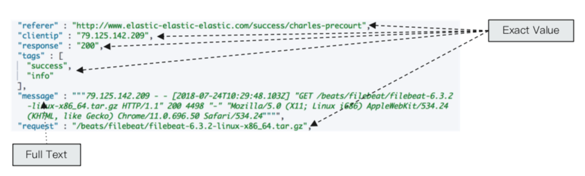

# Mapping & Analysis

## Inverted Index
* [Inverted Index](./reference/inverted_index.pdf)

## Analysis
* What is analysis: convert document to a series of term/token using **Analyzer**
* Analyzer component:
    * Character Fileters: Deal with original context. E.g. Delete html tag
    * Tokenizer: split words using a specific rule
    * Token Filter: Delete stop words, process words, etc.

    ```
    +----------------------------------------------------+
    | Character Filters --> Tokenizer --> Token Filters  |
    +----------------------------------------------------+
    ``` 
    
* _analyzer API example
    ```
    GET /_analyze
    {
        "analyzer": "standard",
        "text": "Mastering Elasticsearch, elasticsearch in Action"
    }
    ```

    ```
    {
        "tokens" : [
            {
                "token" : "mastering",
                "start_offset" : 0,
                "end_offset" : 9,
                "type" : "<ALPHANUM>",
                "position" : 0
            },
            {
                "token" : "elasticsearch",
                "start_offset" : 10,
                "end_offset" : 23,
                "type" : "<ALPHANUM>",
                "position" : 1
            },
            ....
        ]
    }
    ```

### Exact Values v.s. Full Text
* Exact Value: number/ date/ string and etc.
    * "keyword" in ES
    * No Analysis
    * Every field are used to create Inverted index
* Full text
    * "text" in ES

    

### Character Filters
* Deal with original context. 
* Could use multiple character filters
* ES Comes with Character Filters
    * HTML strip - delete html tag
        ```
        POST _analyze
        {
            "tokenizer":"keyword",
            "char_filter":["html_strip"],
            "text": "<b>hello world</b>"
        }
        ```

        returns:

        ```
        {
        "tokens" : [
            {
            "token" : "hello world",
            "start_offset" : 3,
            "end_offset" : 18,
            "type" : "word",
            "position" : 0
            }
        ]
        }
        ```

    * Mapping - content replace

        ```
        POST _analyze
        {
        "tokenizer": "standard",
        "char_filter": [
            {
                "type" : "mapping",
                "mappings" : [ "- => _"]
            }
            ],
        "text": "123-456, I-test! test-990 650-555-1234"
        }
        ```

        returns
        
        ```
        {
        "tokens" : [
            {
            "token" : "123_456",
            "start_offset" : 0,
            "end_offset" : 7,
            "type" : "<NUM>",
            "position" : 0
            },
            ...
        ]
        }
        ```
    * Pattern replace - content replace using regular expression

        ```
        GET _analyze
        {
        "tokenizer": "standard",
        "char_filter": [
            {
                "type" : "pattern_replace",
                "pattern" : "http://(.*)",
                "replacement" : "$1"
            }
            ],
            "text" : "http://www.elastic.co"
        }
        ```

### Tokenizer
* Split text into terms(tokens) according the rules define
* ES Comes with Tokenizer
    * Whitespace: split by white space
    * Standard: split by non-alphanumeric
    * uax_url_email: treat email address as a 'keyword'
        ```
        POST _analyze
        {
        "tokenizer": "uax_url_email",
        "text": ["weic2@rpi.edumy email"]
        }
        ```

        returns
        ```
        {
        "tokens" : [
            {
            "token" : "weic2@rpi.edu",
            "start_offset" : 0,
            "end_offset" : 13,
            "type" : "<EMAIL>",
            "position" : 0
            },
            {
            "token" : "my",
            "start_offset" : 13,
            "end_offset" : 15,
            "type" : "<ALPHANUM>",
            "position" : 1
            },
            {
            "token" : "email",
            "start_offset" : 16,
            "end_offset" : 21,
            "type" : "<ALPHANUM>",
            "position" : 2
            }
        ]
        }
        ```
    * pattern
    * keyword
    * path hierarchy: treat the input text as a path, show hierarchy

        ```
        POST _analyze
        {
        "tokenizer":"path_hierarchy",
        "text":"/user/canshi/a/b/c/d/e"
        }
        ```

        returns 

        ```
        {
        "tokens" : [
            {
            "token" : "/user",
            "start_offset" : 0,
            "end_offset" : 5,
            "type" : "word",
            "position" : 0
            },
            {
            "token" : "/user/canshi",
            "start_offset" : 0,
            "end_offset" : 12,
            "type" : "word",
            "position" : 0
            },
            {
                ...
            },
            ...
        }
        ```

### Token Filters
* Operations on each terms given by tokenizer.
* ES Comes with Token Filters:
    * Lowercase/ stop/ synonym

    ```
    GET _analyze
    {
    "tokenizer": "whitespace",
    "filter": ["stop", "lowercase"],
    "text": ["The rain in Spain falls mainly on the plain."]
    }
    ```

### Customer Analyzer

* Basic

    ```
    PUT my_index {
        "settings": {
            "analysis": {
                "analyzer": {
                    "my_analyzer": {
                        "type": "custom",
                        "tokenizer": "standard",
                        "char_filter": ["html_strip"],
                        "filter": ["lowercase", "asciifolding"]
                    }
                }
            }
        }
    }
    ```

    use customer analyzer:

    ```
    POST my_index/_analyze
    {
    "analyzer": "my_custom_analyzer",
    "text": "Is this <b>déjà vu</b>?"
    }
    ```

* Customer tokenizer, char_filter, filter

    ```
    PUT my_index
    {
    "settings": {
        "analysis": {
            "analyzer": {
                ...
            },
            
            "tokenizer": {
                "punctuation": { 
                "type": "pattern",
                "pattern": "[ .,!?]"
                }
            },
            "char_filter": {
                "emoticons": { 
                "type": "mapping",
                "mappings": [
                    ":) => _happy_",
                    ":( => _sad_"
                ]
                }
            },
            "filter": {
                "english_stop": { 
                "type": "stop",
                "stopwords": "_english_"
                }
            }
        }
    }
    }
    ```

## Mapping
* Mapping similar to schema in Database system
    * Define name of the field
    * Define type of data (string, integer, boolean)
    * Define setting for inverted index (Analyzed or not analyzed, Analyzer)
* A Mapping belong to the Type of index
    * Every document is a Type
    * Every Type contains a definition of Mapping
* Data type
    * Primitive data type:
        * Text/ Keyword
        * Date
        * Integer/ Floating
        * Boolean
        * IPv4 & IPv6
    * Complex data type:
        * Object/ nested object
    * Special type:
        * geo_point & geo_shape/ percolator

### Dynamic Mapping
* If index does not exist, create the index automatically
* Dynamic Mapping does not need to manually create Mappings
* ES can infer the type of data, but not exactly correct
* Can field of mapping be edited?
    * New Field:
        * **Dynamic == true**: Mapping would be renewed
        * **Dynamic == flase**: Mapping cannot be renewed, the newly added field cannot be used for search
        * **Dynamic == strict**: Fail to write document
    * Existed Field: Onece the data is written in, no more supported on modifying definition of field
* Example:

    ```
    # put a document into the system

    PUT dynamic_mapping_test/_doc/1
    {
        "newField":"someValue"
    }

    # defualt the dynamic mapping set as true
    # if set the dynamic mapping to false

    PUT dynamic_mapping_test/_mapping
    {
        "dynamic": false
    }

    # if update the document, the mapping still use only "newField"
    # and no "anotherField" would be included

    PUT dynamic_mapping_test/_doc/1
    {
        "anotherField":"another"
    }
    ```

### Mapping Operation

* Define a mapping

    ```
    PUT movies
    {
        "mappings": {
            # ....
        }
    }
    ```

* Field indexing setting
    * Field indexing setting defualt to be true
    * If set the index to false, then this field cannot be searched

    ```
    PUT users
    {
        "mappings": {
            "properties": {
                "firstName": {
                    "type": "text"
                },
                "lastName": {
                    "type": "text"
                },
                "mobile": {
                    "type": "text",
                    "index": false
                }
            }
        }
    }

    # The search below would fail
    POST /users/_search
    {
        "query": {
            "match": {
            "mobile":"12345678"
            }
        }
    }

    # GET users/_search?q=mobile:12345678
    ```

* Index Options
    * 4 types of index options
        * docs: record `doc id`
        * freqs: record `doc id and term frequencies`
        * positions: record `doc id/ term frequencies/ term position`
        * offsets: record `doc id/ term frequencies/ term position/ character offects`
    * Text default as positions, remaining are docs

    ```
    PUT users
    {
        "mappings": {
            "properties": {
                "firstName": {
                    "type": "text"
                },
                "lastName": {
                    "type": "text"
                },
                "mobile": {
                    "type": "text",
                    "index": false
                }
                "bio": {
                    "type": "text",
                    "index_options": "offsets"
                }
            }
        }
    }
    ```

* null_value:
    * Enable a field to be null and could be search

    ```
    PUT users
    {
        "mappings": {
            "properties": {
                "firstName": {
                    "type": "text"
                },
                "lastName": {
                    "type": "text"
                },
                "mobile": {
                    "type": "text",
                    "null_value": "NULL"
                }
            }
        }
    }
    ```

    returns:

    ```
    ...

    "_source": {
        "firstName": "canshi",
        "lastName": "wei",
        "mobile": null
    }
    ```

* copy_to
    * allows a non-existed filed to be search

    ```
    PUT users
    {
        "mappings": {
            "properties": {
                "firstName": {
                    "type": "text",
                    "copy_to": "fullName"
                },
                "lastName": {
                    "type": "text",
                    "copy_to": "fullName"
                },
            }
        }
    }

    GET users/_search?q=fullName:(Canshi Wei)
    ```

* Array
    * Not a true array, but a field contains multiple value
    * The type of the field associated with multiple value is the type of the value

    ```
    PUT users/_doc/1
    {
        "name": "onebird",
        "interests": ["reading", "music"]
    }
    ```

## Index Template

* use `_template` API create index template

```
PUT _template/template_default
{
    "index_pattern": ["*"],
    "order": 0,
    "version": 1,
    "settings": {
        "number_of_shards": 1,
        "number_of_replicas": 1
    }
}
```

```
PUT _template/template_test
{
    "index_pattern": ["test*"],
    "order": 1,
    "version": 1,
    "settings": {
        "number_of_shards": 1,
        "number_of_replicas": 2
    }
    "mappings": {
        "date_detection": false,
        "numeric_detection": true
    }
}
```

* Priority
    1. Use default ES settings & mappings
    2. Template with lower `order` override defualt setting
    3. Template with higher `order` override previous setting
    4. User defined `Settings` and Mappings override previous setting

## Dynamic Mapping
* Define in a index mappings
* Every template has a name
* Used to set mapping for a matched field

```
PUT my_index
{
  "mappings": {
    "dynamic_templates": [
    {
        "strings_as_boolean": {
          "match_mapping_type": "string",
          "match":"is*",
          "mapping": {
            "type": "boolean"
          }
        }
    },

    {
        "strings_as_keywords": {
            "match_mapping_type": "string",
            "mapping": {
            "type": "keyword"
            }
        }
    }
    ]
  }
}
```