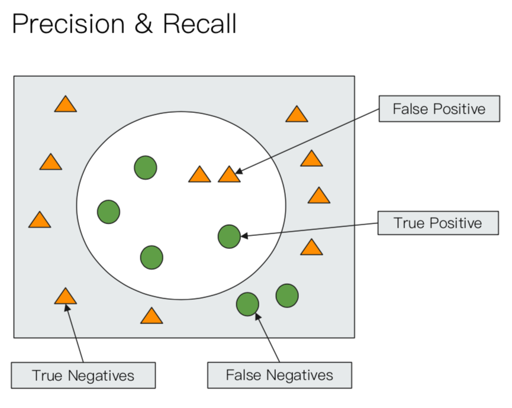

# Search

### Relevance
* Page Rank algorithm
* Information Retrieval
    
    * Precision:
        * True positive / All returned result
        * return unrelated documents as less as possible
    * Recall: 
        * True positive / (True positives + False Negatives)
        * return related documents as much as possible
    * Ranking: sort in order of relativity

### URI Search

* q: indicate the string to search, use query string syntax

    ```
    curl -XGET
    "http://localhost:9200/movies/_search?q=movie:'Beautiful Dream'"
    ```

* df: specify the field to search
* sort
* from/size: for pagination
* profile: check how search execute

    ```
    GET /movies/_search?q=2012&df=title&sort=year:desc&from=0&size=10&timeout=1s
    {
        "profile": true
    }
    ```

* Query String Syntax
    * specific field/ search all
        ```
        q = title: 2020
        q = 2012
        ```
    * Term v.s Phrase
        * Beautiful Mind == Beautiful OR Mind  (Term)
        * "Beautiful Mind" == Beautiful AND Mind (Phrase)

    * group and colon
        ```
        title:(Beautifule AND Mind)
        title="Beautiful Mind"
        ```
    * Boolean
        * AND / OR / NOT  
        * &&/||/!
    * Group
        * \+ represent must
        * \- represent must_not
        ```
        title:(+matrix -reloaded)
        ```
    * Range
        * closed interval: []
        * open interval: {}
        ```
        year: {2019 TO 2018}
        year: [* TO 2018]
        ```
    * Mathematics symbol
        * year:> 2010
        * year:(>2010 && <= 2018)
        * year:(+>2010 +<=2019)
    * Wildcard
        * ?: one symbol
        * *: 0 or multiple symbol
        ```
        title:mi?d
        title:be*
        ```
    * Regex
        ```
        title:[bt]oy
        ```
    * Fuzzy / Approximate matching
        ```
        title:befutifl~1
        title:"lord rings"~2
        ```
### Request Body Search
* Provided by ES: Query Domain Specific Language (DSL)

    ```
    curl -XGET "http://localhost:9200/movies/_search" -H 
    'Content-Type: application/json' -d'
    { 
        "query": {
            "match_all": {}
        }
    }'
    ```

* Pagination
    * from: Starting document offset. Defaults to 0.
    * size: The number of hits to return. Defaults to 10.

    ```
    POST /movies/_search
    {   
        "from": 10,
        "size": 20,
        "query": {
            "match_all": {}
        }
    }
    ```

* Sort
    ```
    POST /movies/_search
    {   
        "sort": [{"order_date": "desc"}]
        "from": 10,
        "size": 20,
        "query": {
            "match_all": {}
        }
    }
    ```

* Source filtering
    * if _source does not exist, only return fileds exist

    ```
    POST kibana_sample_data_ecommerce/_search
    {
        "_source":["order_date", "nonexist_field"],
        "query":{
            "match_all": {}
        }
    }
    ```

    returns

    ```
    hits" : [
      {
        "_index" : "kibana_sample_data_ecommerce",
        "_type" : "_doc",
        "_id" : "aFZZDnAB8IKlC2bdYsN-",
        "_score" : 1.0,
        "_source" : {
          "order_date" : "2020-02-13T21:56:10+00:00"
        }
      },
    ```

* Script Field
    * Combine several field to a new field

    ```
    GET movies/_search
    {
        "script_fields": {
            "my_new_field": {
                "script": {
                    "lang": "painless",
                    "source": "doc['year'].value + ' is good'"
                }
            }
        }
    }
    ```

    return 

    ```
    "hits" : [
      {
        "_index" : "movies",
        "_type" : "_doc",
        "_id" : "2822",
        "_score" : 1.0,
        "fields" : {
          "my_new_field" : [
            "1992 is good"
          ]
        }
      },
    ```

* Match
    * If no operator specified, terms are linked by "OR"

    ```
    POST movies/_search
    {
        "query": {
            "match": {
                "title": "last christmas"
            }
        }
    }

    POST movies/_search
    {
        "query": {
            "match": {
                "title": {
                    "query": "last christmas",
                    "operator": "and"
                }
            }
        }
    }
    ```

* Match phrase
    * slop: Maximum number of positions allowed between matching tokens. Defaults to 0. Transposed terms have a slop of 2. 

    ```
    POST movies/_search
    {
        "query": {
            "match_phrase": {
                "title":{
                    "query": "one love"

                }
            }
        }
    }

    POST movies/_search
    {
        "query": {
            "match_phrase": {
                "title":{
                    "query": "one love",
                    "slop": 1
                }
            }
        }
    }
    ```