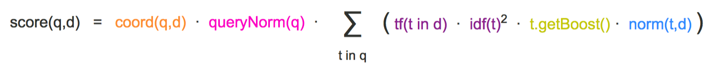
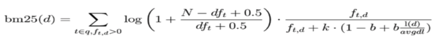

# Advanced Query

## Term Query vs. Full text Query

* Term Query:
    * Samllest unit in semantic
    * **No analysis** on Term query

        ```
        # post a bulk of index

        POST /products/_bulk
        { "index": { "_id": 1 }}
        { "productID" : "XHDK-A-1293-#fJ3","desc":"iPhone" }
        { "index": { "_id": 2 }}
        { "productID" : "KDKE-B-9947-#kL5","desc":"iPad" }
        { "index": { "_id": 3 }}
        { "productID" : "JODL-X-1937-#pV7","desc":"MBP" }

        # query has no match 
        POST /products/_search
        {
        "query": {
            "term": {
            "desc": {
                "value": "iPhone"
            }
            }
        }
        }
        ```

        Because ES use `standard analyzer` for all text analysis,
        <br>
        Solution 1: use analyzed form of term
        ```
        POST /products/_search
        {
        "query": {
            "term": {
                "desc": {
                    "value": "iphone"
                }
            }
        }
        }
        ```

        Solution 2: extract the keyword instead of the term been analyized

        ```
        POST /products/_search
        {
        "query": {
            "term": {
            "desc.keyword": {
                "value":"iPhone"
            }
            }
        }
        }
        ```

        Solution 3: use text search

        ```
        POST products/_search
        {
        "query": {
            "match": {
                "desc": "iPhone"
            }
        }
        }
        ```

    * Calculate relativity score on each documents
    * Use `Constant Score` change query to a filtering, avoid relativity score calculation, use cache to improve performance
        * Avoid TF-IDF 
        ```
        POST products/_search
        {
            "explain": true,
            "query": {
                "constant_score": {
                    "filter": {
                        "term": {
                            "productID.keyword": "XHDK-A-1293-#fJ3"
                        }
                    }
                }
            }
        }
        ```

* Full Text Query
    * Match Query/ Match Phrase Query / Query String Query
        ```
        POST groups/_search
        {
            "query": {
                "match": {
                    "names": {
                        "query": "Water Water",
                        "operator": "OR"
                    }
                }
            }
        }


        POST groups/_search
        {
            "query": {
                "match_phrase": {
                    "names": "Water Smith"
                }
            }
        }
        ```

## Information Retrieval

### TF
* TF - Term frequency
    * The frequency of a term appear in a document
    * TF = time appear / total document terms
    * Example: "Blockchain is good"
        * TF = TF(Blockchain) + TF(is) + TF(good)
* Stop Word
    * Words like "is" has no contribution to relevance of document

## IDF
* DF - Document frequency
    * The term frenquency in all documents
* IDF - Inverse Document Frequency
    * IDF = log (total document count/ number of document the term appear)
* TF-IDF:
    * Example: "Blockchain is good" ("is" is a stop word, eliminated in this example)
        * TF-IDF =  TF(Blockchain) * IDF(Blockchain) +  TF(good) * IDF(good)

## Lucene TF-IDF



## BM 25


