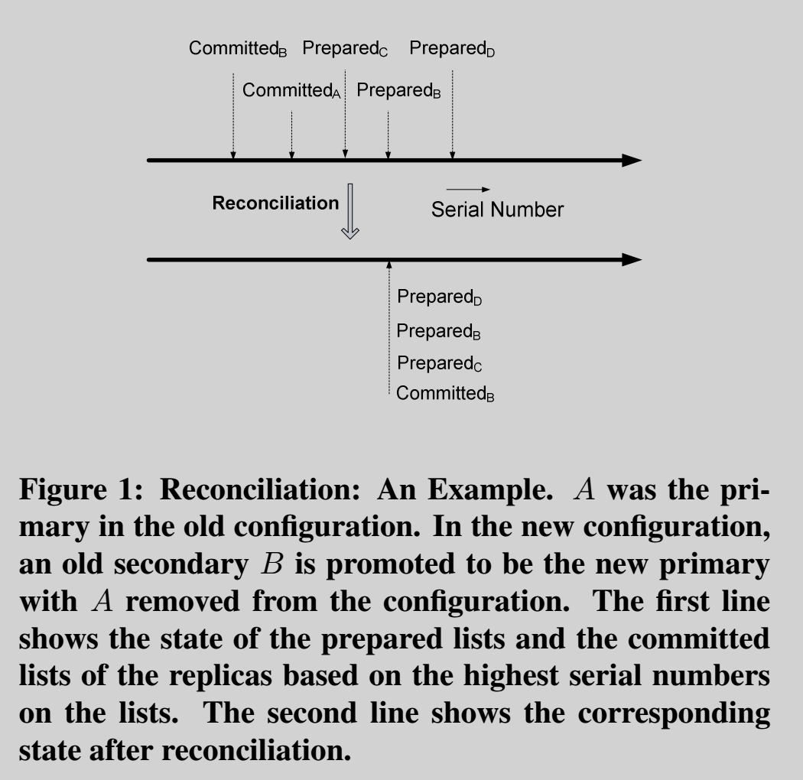

# PacificA: Replication in Log-Based Distributed Storage Systems

## Introduction

* PacificA
    * A prototype of a distributed log-based system for storing structured and semi-structured web data

* Three principles through the replication framwork
    * The separation of replica group configuration management from data replication, which Paxos for managing configurations and primary/backup
    * Decentralized monitoring for detecting failures and triggering reconfiguration, with monitoring traffic follows the communication patterns of data replication
    * A general and abstract model that clarifies correctness and allows different practical instantiations

## Pacifica Replication Framework

### Assumptions

* Replication protocols of the system achieve **strong consistency**
    * Strong consistency ensures that replicated system behaves the same as its non-replicated counterpart that achieves semantics such as linearizability
    * Strong consistency can be achieved if all servers in a replica group process **the same set of requests** in the **same order**
* Servers might fail
    * Assume fail-stop failures
    * Messages could be dropped or re-orderded, but not injected or modified
    * Network partitions could also occur
    * Clocks on servers are not necessarily sunchronized or even loosely sunchronized, but clock drifts are assumed to be bounded
* System maintiains a large set of data
    * Each piece of data is replicated on a set of servers, referred to as the **replica group**
    * The data replication protocol follows the primary backup paradigm
    * One replica in replica group is designated as **primary**, while others are called the **secondaries**
    * The **Configuration** for a replica group changes due to replica failures or additions
    * **Versions** are used to track the change in configuration

### Primary/Backup Data Replication

* Primary/backup paradigm
    * All requests are sent to the primary
    * The primary processes all queries locally and involves all secondaries in processing updates
* Model
    * Nodes maintains a **prepared list** of requests and a **committed point** to the list
        * **Only one committed point may applied to ensure the order of modification of data (data + 1 * 2 != data * 2 + 1)**
    * The prefix of the prepared list up to the committed point is referred to as the **committed list**
* Normal-Case Query
    * Primary receives a query, it processes the query against the state represented by the current committed list and returns the response immediately
* Normal-Case Update
    * Primary p assigns the **next available serial number** to the request
    * Primary p sends request with its **configuration versoin** and the **serial number** in a prepare message to all replicas
    * Replica r receives the prepare message then inserts the request to is prepared list in the serial number order
        * Then the request is considered **prepared** on the replica
    * Replica sends an acknowledgment in a prepared message to the primary
    * Primary view a request is **committed** after it receives acknowledgments from **all** replicas
        * Then primary moves its committed point forward to the highest point
    * Primary then sends the acknowledgement to the client indicating a successful completion
    * Replica further move its **committed point** accordingly
* **Commit Invariant**
    * Let p be the primary and q be any replica in the current configuration, **committed_q** \subseteq **committed_p** \subseteq **prepared_q** holds

### Configuration Management

* A **global configuration manager** is in charge of maintaining the configutations for all replica groups in the system
    * For **each replica group**, the configuration manager maintains the truth of the current configuration and its version
* When system suspects the faulty of a replica, **reconfiguration** happen:
    * Either **remove the faulty replica** or **propose to add new replicas to the configuration**
    * A server sends the proposed new configuration together with its current configuration version to the configuration manager
        * The **request will be honored** if and only if the **version matches** that of the current configuration on the configuration manager
        * Then proposed new configuration is installed with the **next higher version**
        * The **first request** that is accepted by the configuratoin manager wins. All other conflicting requests are rejected because the configuration manager has already advanced to a new configuration with a higher version
        * **Primary Invariant**: At any time, a server p considers itself a primary only if the configuration manager has p as the primary in the current configuration it maintains. Hence, at any time, there exists at most one server that considers itself a primary for the replica group

#### Leases and Failure Detection

* The **primary takes a leases** from each of the secondaries by periodically sending beacons to the secondaries and waiting for acknoledgments
    * The primary considers its **lease expired** if a specified **lease period** has passed since the sending time of the **last acknowledged beacon**
    * When any lease from a secondary expires, **the primary no longer considers itself a primary** and stops processing queries or update
        * In this case, the primary will contact the configuration manager to **remove the secondary from the current configuration**

* The **secondary acknowledges the beacons** as long as the senders remains the primary in the current configuration
    * If a **grace period** as passed since the last received beacon from the primary, then the secondary considers the lease to the primary expired and will contact the configuration manager to **remove the current primary** and **become the new primary**

* As long as the **grace period is the same as or longer than the lease period**, the lease is guaranteed to **expire on the primary before it does on the secondary**

* The failure detection is between two servers that already need to communicate with each other for data processing

#### Reconfiguration, Reconciliation, and Recovery

* **Removal of Secondaries**
    * The primary proposes a new configuration that excludes those suspected secondaries and continues without those secondaries after the configuration manager approves the proposal

* **Change of Primary**
    * The secondary *p* proposes a new configuration with itself being the new primary and with the old primary excluded, when approved, the secondary considers itself the new primary and starts to process new requests only after it completes a **reconciliation** process
    * **Reconciliation**
        * *p* sends prepare messages for uncommitted requests in its prepared list and have them committed on the new configuration
        * Let *sn* be the serial number corresponding to to *p*'s committed point after reconciliation, *p* then instructs all replicas to truncate their prepared lists and keep only all requests up to serial number *sn*
        
    * **Reconfiguration Invariant**: If a new primary p completes reconciliation at time t, any committed list that is maintained by any replica in the replica group at any time before t is guaranteed to be a prefix of committed_p at time t. Commit Invariant holds in the new configuration
        * What if a server has a prepared point before the commit point of another replica?
            * This case is impossible to happen. As shown in the following example, assume A is the old primary, B is the secondary send request to mannager first, according to **Commit Invariant**, it is invalid if prepared B, which is a list contains all the request, before the committed A. The following example would never happen.
            * The committed point of primary is a subsequence of every prepared list of secondary

                ```
                committedB   committedC   committedA
                    |          |           |
                ----^--^-------^-----------^---
                       |
                   prepared B
                ```

* **Addition of New Secondaries**
    * Commit Invariant must be preserved when a new server is added to the configuration
    * The process for a new replica to acquire the right state is referred to as **recovery**
    * **Recovery**
        * A new replica joins as a **candidate secondary**
        * The primary continues to process updates and sends **prepare messages** to the candidate secondary *c*
        * Candidate secondary *c* also fetches the portion of the prepared list from existing replica
        * When *c* finally catches up, it asks the primary to add *c* to the configuration

## Primary/Backup vs. Paxos
* Paxos is not sensitive to transient performance problems related to a minority of replica: it is able to commit requests on the fastest majority; others can catch up in the background. Similarly, the failure of a minority of replicas has minimal performance impact
    * Primary/Backup cause the protocol to slow down, the failure of any replica stalls the progress until the reconfiguration removes that replica from the replica group
* Paxos is unable to process any request when a majority of the replicas becomes unavailable
* With Paxos, a replica group can reconfigure itself by treating a reconfiguration as a consensus decision in the current configuration, new replica must contact a majority in the current configuration to transfer the state properly
    * Primary/Backup is simple with the help of the separate configuration manager

#### Reference
[PacificA: Replication in Log-Based Distributed Storage Systems](https://www.microsoft.com/en-us/research/wp-content/uploads/2008/02/tr-2008-25.pdf)