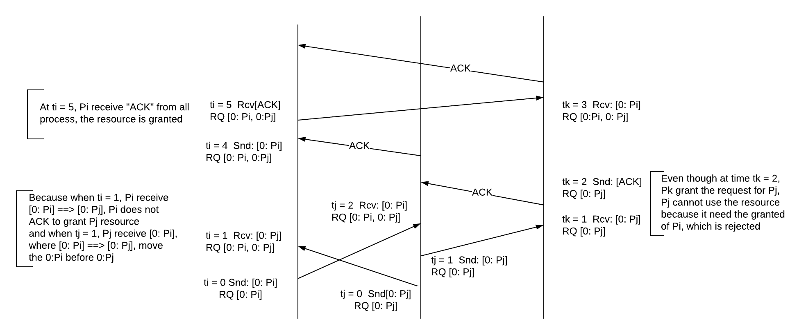

# Time, Clocks, and the Ordering of Events in a Distributed System

## The Partial Ordering

* "Happened before" relation "-->"
    * If a and b are events in the **same process**, and a comes before b, then a --> b
    * If a is the sending of a message by one process and b is the receipt of the same message by another process, than a --> b
    * If a--> b and b --> c then a --> c
    * Two distinct events a and b are said to be **concurrent** if a-/-> b and b -/-> a

## Logical Clocks

* A clock Ci for each process Pi is a function which assigns a number Ci(a) to any event a in that process
* **Clock Condition.** For any events a, b: if a --> b than C(a) \< C(b)
    * C1. If a and b are events in process Pi, and a comes before b, than Ci(a) \< Ci(b)
    * C2.If a is then sending of a message by process Pi and b is the receipt of that message by process Pj, then Ci(a) \< Ci(b)
* Introduce clocks into the processes which satisfy the clock condition
    * **IR1. Each process Pi increments Ci between any two successive events**
    * **IR2.**  
        **(a) If event a is the sending of a message m by process Pi, then the message m contains a timestamp Tm = Ci(a)**  
        **(b) Upon receiving a message m, process Pj sets Cj greater than or equal to its present value and greater than Tm**

## Ordering the Events Totally
* Relation "==>": If a is an event in process Pi and b is an event in process Pj, then a ==> b if and only if either  
    **(i) Ci(a) \< Ci(b)  
    (ii) Ci(a) = Ci(b) and Pi \< Pj** 
* If a --> b then a ==> b
* Example:
    * A system composed of a fixed collection of processes which share a single resource. Only one process can use the resource at a time, so the processes must synchronize themselves to avoid conflict
    * Conditions:
        * A process which has been granted the resource must release it before it can be granted to another process
        * Different requests for the resource must be granted in the order in which they are made
        * If every process which is granted the resource eventually releases it, then every request is eventually granted
    * Algorithm:    
        1. To request the resource, process Pi sends the message Tm:Pi requests resource to every other process, and puts that message on its request queue, where Tm is the timestamp of the message
        2. When process Pj receives the message Tm:Pi requestresource, it places it on its request queue and sends a (timestamped) acknowledgement message to Pi
        3. To release the resource, process Pi removes any Tm:Pi requests resource message from its request queue and sneds a (timestamped) Pi releases resource message to every other process
        4. When process Pj receives a Pi releases resource message, it removes any Tm:Pi requests resource message from its request queue
        5. Process Pi is granted the resource when the following two conditions are satisfied:
            * There is a Tm:Pi requests resource message in its request queue which is ordered before any other request in its queue by the relation "==>"
            * Pi has received a message from every other process time-stamped later than Tm
    * Exmple
        

## Physical Clocks
* Ci(t) denotes the reading of the clock Ci at physical time t
* Then dCi(t) / dt represnets the rate at which the clock is running at time t, dCi(t) / dt ~= 1 for al t
    * **PC1. There exists a constant k \<\< 1, such that for all i: | dCi(t)/dt - 1 | \< k**
    * **PC2. For all i, j: |Ci(t) - Cj(t)| \< e**
* Let u be a number such that if event a occurs at physical time t and event b in anohter process satisfies a --> b, then b occurs later than physical time t + u
    * u is less than the shortest transmission time for interprocess message
    * Then we need Ci(t + u) - Cj(t) > 0
    * PC1 then implies that Ci(t + u) - Ci(t) > (1 - k)u
    * PC2 then deduce that Ci(t + u) - Cj(t) > 0 if the following holds
        * e/(1 - k) \<= u
* **IR1'. For each i, if Pi does not receive a message at physical time t, then Ci is differentiable at t and dCi(t) / dt > 0**
* **IR2':   (a) If Pi sends a message m at physical time t, then m contains a timestamp T, = Ci(t). (b) Upon receiving a message m at time t', process Pj sets Cj(t') equal to maximum (Cj(t' - 0), Tm + um)**