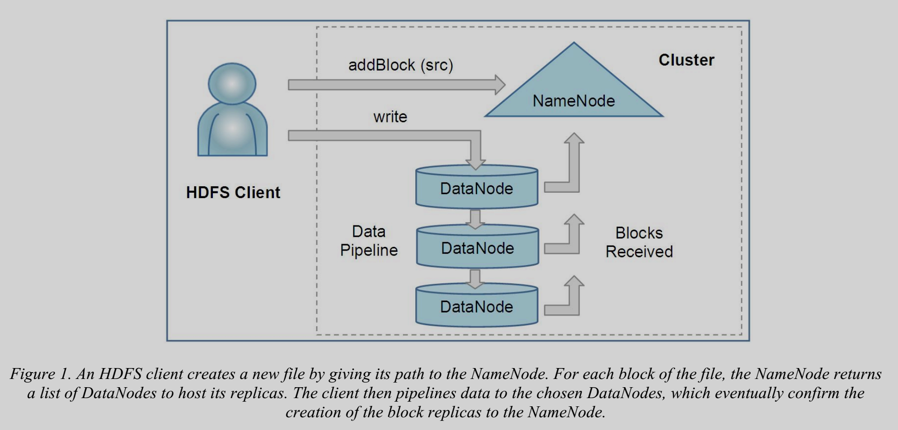
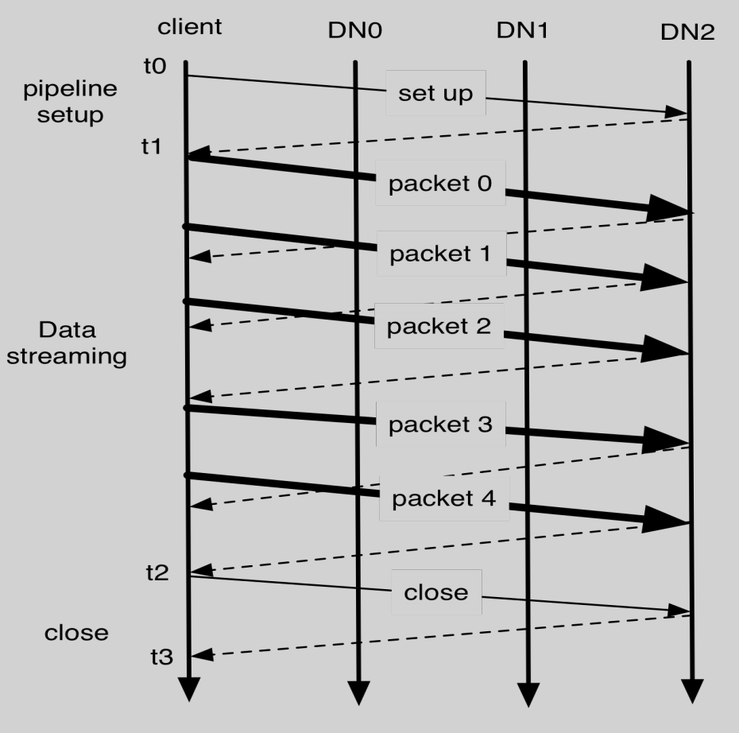
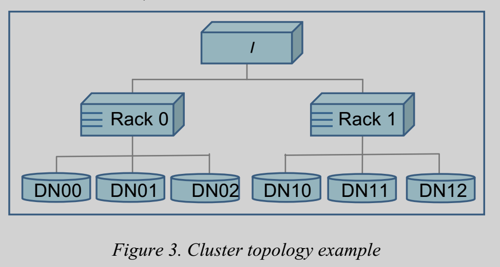

# The Hadoop Distributed File System

## Architecture

### Name Node

* Blocks:
    * File content is split into large blocks
    * Each block of the file is independtly replicated at multiple DataNodes
* Inodes:
    * Represent Files and Directories
    * Record attributes: permissions, modification and access time, namespace and disk space quotas
* Image
    * Meta-data records Inode data and the list of blocks belonging to each file
* CheckPoint
    * Persistent record of the image
* Journal
    * write-ahead commit log
    * Modification log of the image
    * **If either the checkpoint or the journal is missing, or be comes corrupt, the namespce information will be lost partly or entirely**
* NameNode can alternatively execute two other roles: CheckpointNode, or a BackupNodes

### Data Node
* **Each block** replica on a DataNode is represented by **two files** in the local host's native file system
    * data
    * block's metadata:
        * **checksums**
        * generation stamp
* Replication factor
    * Number of replica of the block of file
* NameSpace ID
    * Persistently stored on all nodes of the cluster
    * Nodes with different namespace ID will not be able to join the cluster
    * If DataNode is newly initialized without nameSpace, it is allowed to join cluster and receive the cluster's namespace
* Startup:
    * Handshake with NameNode, check
        * nameSpace ID
        * software version
* Identify block replicas:
    * Send block report, which contains
        * blockid, generation stamp, length of each block replica
* Heartbeat:
    * DataNodes send hearbeats to NameNode to confirm DataNode is operating
    * If NameNode does not recieve hearbeat in ten minutes, it will considers the DataNode to be outof service, then **schedule new replicas** of thoses block on other DataNode
    * NameNode use replies to heartbeats to send instructions to DataNode:
        * **replicate** blocks to other nodes;
        * **remove** local block replicas;
        * **re-register** or to shut down the node
        * send an immediate **block report**

### CheckpointNode
* Periodically combines the existing **checkpoint and journal** to create a **new checkpoint and empty journal**

### Backup Node
* Capable of creating periodic checkpoints
* Maintains an in-memory, up-to-date image of the file system namespace that is always synchronized with the state of the NameNode
* Can be viewed as a read-only NameNode

## File I/O Operations and Replica Management

* HDFS implements a **single-writer**, **multiple-reader** model

### Read Data

* HDFS client contacts NameNode for list of DataNodes that host replicas of the blocks of the file
* HDFS client then contacts a DataNode directly and requests the transfer of the disired block
    * If the read attempt fails, the client tries the next replica in sequence
* HDFS client use the checksum recieved to check if the revieved block is valid
* HDFS permit a client to read a file that is open for writing

### Write Data
* Lease duration:
    * HDFS client opens a file for writing is granted a lease for the file
    * Renew lease by sending hearbeat to NameNode
    * Lease duration is bound by a **soft limit** and a **hard limit**
        * Soft limit: If pass the soft limit client fails to close file, another client can **preempt the lease**
        * Hard limit: If pass the hard limit client fails to renew, HDFS assume client quit and **close the file and recover the lease**
* Need for a new block of a file
    * Allocates a block with a unique block ID
    * Determines a list of DataNodes to host replicas of the block
    * DataNodes form a pipeline, the order of which minimizes the toal network distance from the client to the last DataNode
    
* Block construction goes through three stages:
    * setup stage
    * datastreaming stage
    * close stage
    
* Write process
    * HDFS client ask the NameNode to choose DataNodes to host replicas of the first block of the file
    * Then client organizes a pipeline from node to node and sends the data
    * When the first block is filled, the client requests new DataNodes to be chosen to host replicas of the next block
    * For each block, HDFS client computes the checksum sequence for each block

### Replication management
* The NameNode endeavors to ensure that each block always has the intended number of replicas
* When a block becomes under-replicated, it is put in the replication priority queue
    * Block with only one replica has the highest priority
    * Block with number of replica that is greater than two thirds of its replication factor has the lowest priority

### Block Placement

* **Rack**
    * Spread the nodes across multiple racks
    * Nodes of a rach **share a switch**, and rack switches are connected by one or more core switches
    * When a DataNode registers with the NameNode, the NameNode runs a configured script to decide which rack the node belongs to
        * If no such script is configured, the NameNode assumes that all the nodes belong to a defualt single rack
* Default HDFS block placement policy
    * No Datanode contains more than one replica of any block
    * No rack contains more than two replicas of the same block, provided there are sufficient racks on the cluster

### Balancer

* Balancer
    * Tool that balances disk space usage on an HDFS cluster
    * It takes a **threshold value** as an input parameter, which is a fraction in the range of (0, 1)
        * The utilization of node differs from the utilization of the whole cluster by no more than the threshold value
* Balencing process:
    * minimizing the inter-rack data copying
        * If the balancer decides that a replica A needs to be moved to a different rack and the destination rack happens to have a replica B of the same block, the data will be copied from replica B instead of replica A

### Block Scanner

* Each DataNode runs a block scanner that **periodically scans its block replicas** and verifies that **stored checksums match the block data**
* If read client or a block scanner detects a corrupt block, it notifies NameNode
    * NameNode marks the replica as corrupt, but does not schedule deletion of the replica
    * NameNode starts to replicate a good copy of the block
    * Only when **good replica count reaches the replication factor of the block** the corrupt replica is scheduled to be removed

### Inter-Cluster Data Copy

* HDFS provides a tool called DistCp for large inter/intra-cluster parallel copying
    * It is **MapReduce job**
    * Each of the map tasks copies a portion of the source data into the destination file system
    * The MapReduce framework automatically handles parallel task scheduling, error detection and recovery

